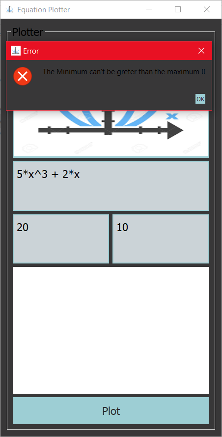

# Qt-Task

## About The Task

> **Equation-Plotter** is simple responsive gui plotter that take from the user an equation and miniumin and maximum ranges and draw the function

### Build with

- [Qt](https://doc.qt.io/qtforpython/)
- [pytest-qt](https://pytest-qt.readthedocs.io/en/latest/intro.html)
- [python](https://www.python.org/)

## Getting Started

> This is an list of needed instructions to set up your project locally, to get a local copy up and running follow these instructuins.

### Installation

1. **_Clone the repository_**

```sh
$ git clone git@github.com:MuhammeedAlaa/Qt-Task.git
```

2. **_Navigate to repository directory_**

```sh
$ cd Qt-Task
```

3. **_Install dependencies_**

```sh
$ pip install PySide2
$ pip install matplotlib
$ pip install numpy
```

### Running

1. **_Running the application_**

```sh
$ python sw_task_01_plotter_v03.py
```

2. **Running the tests**

```sh
$ cd testing-qt/tests
$ pytest testApp.py
```

### Desktop Screenshots

<div align="center">
  




</div>
  
## Contributors

<table>
  <tr>
  <td align="center"><a href=""https://github.com/MuhammeedAlaa" target="_black"><br /><sub><b>Muhamed Alaa</b></sub></a><a href="https://github.com/MuhammeedAlaa/Qt-Task/commits/master?author=MuhammeedAlaa" title="Code">💻</a> <br /></td>
  </tr>
</table>

## License

> This software is licensed under MIT License, See [License](https://github.com/MuhammeedAlaa/Qt-Task/blob/master/LICENSE) for more information ©MuhammeedAlaa.
